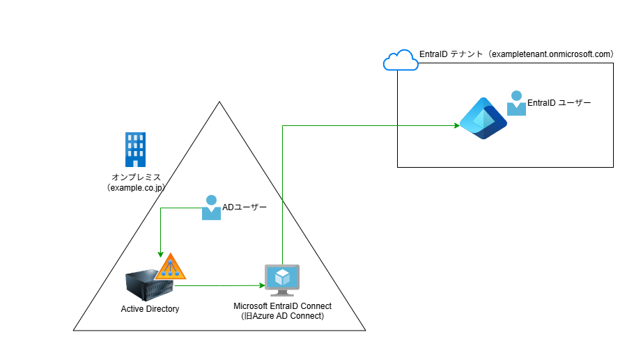

# プロフィールWebサイト 編集ガイド（更新版）

このガイドでは、プロフィールWebサイトの内容を簡単に変更・カスタマイズする方法を説明します。

## 目次

1. [基本情報の変更](#1-基本情報の変更)
2. [プロフィール画像の変更](#2-プロフィール画像の変更)
3. [SNSリンクの変更](#3-snsリンクの変更)
4. [スキルセットの編集](#4-スキルセットの編集)
5. [資格リストの編集](#5-資格リストの編集)
6. [経歴/ポートフォリオページの編集](#6-経歴ポートフォリオページの編集)
7. [デザインのカスタマイズ](#7-デザインのカスタマイズ)
8. [その他の機能調整](#8-その他の機能調整)

## 1. 基本情報の変更

### 名前とタイトルの変更

`index.html`ファイルを開き、以下の箇所を編集します：

```html
<!-- ヘッダーのロゴ部分 -->
<div class="logo">しゃまのプロフィール</div>

<!-- メインビジュアル部分 -->
<h1 class="hero-name">しゃま（修行中）</h1>
<p class="hero-tagline">フリーランスエンジニア | Azure・AWS・インフラ・SRE</p>
```

### プロフィール文の変更

`index.html`ファイルの以下の部分を編集します：

```html
<!-- プロフィール部分 -->
<div class="bio">
  <p>登録販売者として薬局で勤務した後、2019〜2022年春にかけて個人で旅行代理店を運営。コロナ禍で業界が衰退したことをきっかけに、自社ページ制作を通じてIT分野に興味を持ちました。</p>
  <p>2022年春〜夏に <a href="https://learn.geekjob.jp/" target="_blank">GEEK JOB</a> スピード転職コース（Java / インフラ） に参加し、同年秋にSES企業へ入社。システム運用やインフラ構築の経験を積み、2025年よりフリーランスエンジニアとして活動を開始しました。</p>
  <p>クラウド環境（Azure・AWS）の構築・運用、インフラ管理、リソース構成のリファクタリング、CI/CDパイプライン構築、IaC、シングルページアプリ開発など幅広いスキルを有し、特にクラウド環境での設計・構築を得意としています。</p>
  <p>一流のSREを目指し、常に新しい技術へ挑戦しながら、効率的でスケーラブルかつセキュアなシステム構築に取り組んでいます。</p>
</div>
```

### 趣味の文章の変更

`index.html`ファイルの以下の部分を編集します：

```html
<p class="hobby-text">趣味は非日常と癒しを感じること。<br>最近は観葉植物（主にビカクシダ）とサウナとギターに取りつかれています。</p>
```

### ページタイトルとメタ情報の変更

`index.html`の`<head>`セクション内：

```html
<title>しゃま - フリーランスエンジニア</title>
<meta name="description" content="しゃま - フリーランスエンジニアのプロフィールサイト。Azure、AWS、インフラ、SREなどのスキルを持つエンジニアです。">
```

## 2. プロフィール画像の変更

1. 新しいプロフィール画像を`images`フォルダに配置します（推奨サイズ：正方形、最低500x500px）
2. `index.html`ファイル内の以下の部分を編集します：

```html

```

画像のファイル名を新しいファイル名に変更し、`alt`属性も適宜更新してください。

### AIによる作成表示の変更

`index.html`ファイル内の以下の部分を編集します：

```html
<div class="ai-notice">※このWebサイトはManus AIによって作成しています</div>
```

## 3. SNSリンクの変更

`index.html`ファイル内のSNSリンク部分を編集します。以下の2箇所に同じSNSリンクがあります：

### メインビジュアル部分（サービス名付き）

```html
<div class="social-links">
  <a href="https://note.com/syam_grit" target="_blank" aria-label="Note"><i class="fas fa-book"></i><span class="service-name">Note</span></a>
  <a href="https://zenn.dev/gritio28tech" target="_blank" aria-label="Zenn"><i class="fas fa-code"></i><span class="service-name">Zenn</span></a>
  <a href="https://github.com/SyamGRITio" target="_blank" aria-label="GitHub"><i class="fab fa-github"></i><span class="service-name">GitHub</span></a>
  <a href="https://x.com/syam_nihick" target="_blank" aria-label="Twitter"><i class="fab fa-twitter"></i><span class="service-name">Twitter</span></a>
</div>
```

### フッター部分（アイコンのみ）

```html
<div class="social-links">
  <a href="https://note.com/syam_grit" target="_blank" aria-label="Note"><i class="fas fa-book"></i></a>
  <a href="https://zenn.dev/gritio28tech" target="_blank" aria-label="Zenn"><i class="fas fa-code"></i></a>
  <a href="https://github.com/SyamGRITio" target="_blank" aria-label="GitHub"><i class="fab fa-github"></i></a>
  <a href="https://x.com/syam_nihick" target="_blank" aria-label="Twitter"><i class="fab fa-twitter"></i></a>
</div>
```

各リンクの`href`属性を自分のSNSアカウントのURLに変更します。

### SNSアイコンの変更・追加

現在使用しているアイコンはFont Awesomeのものです。別のSNSを追加したい場合は、以下のような形式で追加できます：

```html
<!-- メインビジュアル部分（サービス名付き） -->
<a href="あなたのSNSのURL" target="_blank" aria-label="SNS名"><i class="fab fa-アイコン名"></i><span class="service-name">SNS名</span></a>

<!-- フッター部分（アイコンのみ） -->
<a href="あなたのSNSのURL" target="_blank" aria-label="SNS名"><i class="fab fa-アイコン名"></i></a>
```

Font Awesomeで利用可能なアイコン一覧は[こちら](https://fontawesome.com/icons)で確認できます。

## 4. スキルセットの編集

`index.html`ファイル内のスキルセクションを編集します：

```html
<div class="skills-container">
  <div class="skill-item">
    <div class="skill-name">クラウド</div>
    <p>Azure・AWS 環境の設計・構築・運用、IaC（Infrastructure as Code）、CI/CD、リソース最適化、構成リファクタリング対応、サードパーティーツール連携</p>
  </div>
  <div class="skill-item">
    <div class="skill-name">インフラ</div>
    <p>サーバ運用・監視、Active Directory、DNS サーバ、Microsoft Entra ID Connect、プロキシサーバ（Squid・Nginx）、ファイルサーバ移行、バッチ作成</p>
  </div>
  <div class="skill-item">
    <div class="skill-name">開発</div>
    <p>※開発案件経験は限定的<br>RAG基盤構築（開発環境構築支援）、シングルページWeb開発、バックエンド開発支援・リファクタリング対応、Go・Python学習中</p>
  </div>
  <div class="skill-item">
    <div class="skill-name">セキュリティ</div>
    <p>CASB 導入・運用経験、CrowdStrike によるエンドポイント防御、Prisma Cloud を用いたクラウドワークロード保護、MFA 設計・実装、ベストプラクティスに基づくセキュリティアーキテクチャ設計、クラウド／ネットワークセキュリティ設計</p>
  </div>
</div>
```

スキルを追加する場合は、以下のテンプレートを使用して新しい`skill-item`を追加します：

```html
<div class="skill-item">
  <div class="skill-name">スキル名</div>
  <p>スキルの詳細説明</p>
</div>
```

## 5. 資格リストの編集

`index.html`ファイル内の資格セクションを編集します：

```html
<div class="certifications-container">
  <div class="cert-category">
    <h3>Microsoft認定資格</h3>
    <ul class="cert-list">
      <li>AZ-900: Microsoft Azure Fundamentals</li>
      <!-- 他の資格 -->
    </ul>
  </div>
  <div class="cert-category">
    <h3>AWS認定資格</h3>
    <ul class="cert-list">
      <li>AWS Certified Cloud Practitioner (CLF)</li>
      <!-- 他の資格 -->
    </ul>
  </div>
  <div class="cert-category">
    <h3>その他の資格</h3>
    <ul class="cert-list">
      <li>JP1認定エンジニア(V12)</li>
      <li>IPA-セキュリティマネジメント試験</li>
      <li>Cisco Certified Network Associate（CCNA)</li>
      <li>JDLA Deep Learning for GENERAL（G検定）</li>
      <li>Python3エンジニア認定資格</li>
      <li>Linux Professional Institute LPIC-1</li>
    </ul>
  </div>
</div>
```

### 資格の追加・削除

資格を追加するには、該当するカテゴリの`<ul class="cert-list">`内に`<li>`要素を追加します：

```html
<li>新しい資格名</li>
```

### 資格カテゴリの追加

新しいカテゴリを追加するには、以下のテンプレートを使用します：

```html
<div class="cert-category">
  <h3>新しいカテゴリ名</h3>
  <ul class="cert-list">
    <li>資格1</li>
    <li>資格2</li>
    <!-- 他の資格 -->
  </ul>
</div>
```

## 6. 経歴/ポートフォリオページの編集

### プロジェクト情報の編集

`portfolio.html`ファイル内のプロジェクトカードを編集します。各プロジェクトは以下のような構造になっています：

```html
<div class="project-card fade-in delay-1">
  <div class="project-header">
    <h2 class="project-title">プロジェクトタイトル</h2>
  </div>
  
  <div class="project-content">
    <p>プロジェクト概要の説明文...</p>
    
    <h3 class="project-subtitle">主な成果と取り組み</h3>
    <ul class="project-list">
      <li>成果1</li>
      <li>成果2</li>
      <!-- 他の成果 -->
    </ul>
    
    <h3 class="project-subtitle">使用技術</h3>
    <div class="tech-tags">
      <span class="tech-tag">技術1</span>
      <span class="tech-tag">技術2</span>
      <!-- 他の技術 -->
    </div>
  </div>
</div>
```

### プロジェクトの追加

新しいプロジェクトを追加するには、上記のテンプレートをコピーして`portfolio-container`内に追加し、内容を編集します。

### プロジェクト画像の変更

プロジェクトのアーキテクチャ図を変更するには：

1. 新しい画像を`images`フォルダに配置します
2. `portfolio.html`ファイル内の該当プロジェクトの``タグを編集します：

```html

```

### 導入文の編集

`portfolio.html`ファイル内の導入文を編集します：

```html
<div class="portfolio-intro">
  <p>私のこれまでの主要プロジェクトと実績をご紹介します。クラウド環境の設計・構築からインフラ運用、セキュリティ対策まで、幅広い経験を積んできました。各プロジェクトでは技術的な課題解決だけでなく、ドキュメント整備や知識共有にも注力し、チーム全体の生産性向上に貢献してきました。</p>
</div>
```

## 7. デザインのカスタマイズ

### カラーテーマの変更

`css/style.css`ファイルの先頭にあるCSS変数を編集することで、サイト全体のカラーテーマを簡単に変更できます：

```css
:root {
  /* ダークモード（デフォルト） */
  --bg-color: #222222;
  --text-color: #EEEEEE;
  --accent-color: #4A89DC;
  --secondary-color: #666666;
  --border-color: #444444;
  --card-bg-color: #333333;
  --hover-color: #555555;
  
  /* アニメーション */
  --transition-speed: 0.3s;
}

/* ライトモード */
[data-theme="light"] {
  --bg-color: #F5F5F5;
  --text-color: #333333;
  --accent-color: #3A6BC5;
  --secondary-color: #888888;
  --border-color: #DDDDDD;
  --card-bg-color: #FFFFFF;
  --hover-color: #EEEEEE;
}
```

各変数の役割：
- `--bg-color`: 背景色
- `--text-color`: 文字色
- `--accent-color`: アクセントカラー（見出しやリンク）
- `--secondary-color`: 補助色
- `--border-color`: 境界線の色
- `--card-bg-color`: カード背景色
- `--hover-color`: ホバー時の色

### フォントの変更

フォントを変更するには、`index.html`と`portfolio.html`の`<head>`セクション内のGoogle Fontsリンクと、`css/style.css`のフォント指定を変更します：

1. HTMLファイル内のGoogle Fontsリンク：

```html
<link href="https://fonts.googleapis.com/css2?family=Inter:wght@400;700&family=Roboto:wght@400;700&display=swap" rel="stylesheet">
```

2. `css/style.css`内のフォント指定：

```css
body {
  font-family: 'Roboto', sans-serif;
  /* 他のスタイル */
}

h1, h2, h3, h4, h5, h6 {
  font-family: 'Inter', sans-serif;
  /* 他のスタイル */
}
```

## 8. その他の機能調整

### ダークモード切替の表示テキスト変更

`js/main.js`ファイル内の以下の部分を編集することで、ダークモード切替ボタンのテキストを変更できます：

```javascript
function applyTheme(theme) {
  const themeIcon = document.querySelector('.theme-toggle i');
  const themeText = document.querySelector('.theme-toggle .theme-text');
  
  if (theme === 'dark') {
    document.documentElement.removeAttribute('data-theme');
    themeIcon.className = 'fas fa-sun';
    if (themeText) themeText.textContent = 'ライト';
  } else {
    document.documentElement.setAttribute('data-theme', 'light');
    themeIcon.className = 'fas fa-moon';
    if (themeText) themeText.textContent = 'ダーク';
  }
}
```

### ダークモードのデフォルト設定

`js/main.js`ファイル内の以下の部分を編集することで、デフォルトのテーマを変更できます：

```javascript
// 初期テーマの設定
if (!currentTheme) {
  currentTheme = prefersDarkScheme.matches ? 'dark' : 'light';
  localStorage.setItem('theme', currentTheme);
}
```

ダークモードを常にデフォルトにしたい場合は、以下のように変更します：

```javascript
// 初期テーマの設定
if (!currentTheme) {
  currentTheme = 'dark'; // 常にダークモードをデフォルトに
  localStorage.setItem('theme', currentTheme);
}
```

### アニメーション速度の調整

`css/style.css`ファイル内の変数を編集することで、アニメーション速度を調整できます：

```css
:root {
  /* 他の変数 */
  --transition-speed: 0.3s; /* アニメーション速度 */
}
```

値を大きくするとアニメーションが遅くなり、小さくすると速くなります。

### フッターの著作権表示の変更

`index.html`と`portfolio.html`ファイル内のフッター部分を編集します：

```html
<p class="copyright">&copy; <span id="current-year"></span> しゃま. All Rights Reserved.</p>
```

「しゃま」の部分を自分の名前や組織名に変更してください。

---

このガイドで説明していない変更や、より複雑なカスタマイズが必要な場合は、HTML、CSS、JavaScriptの基本的な知識が必要になります。
