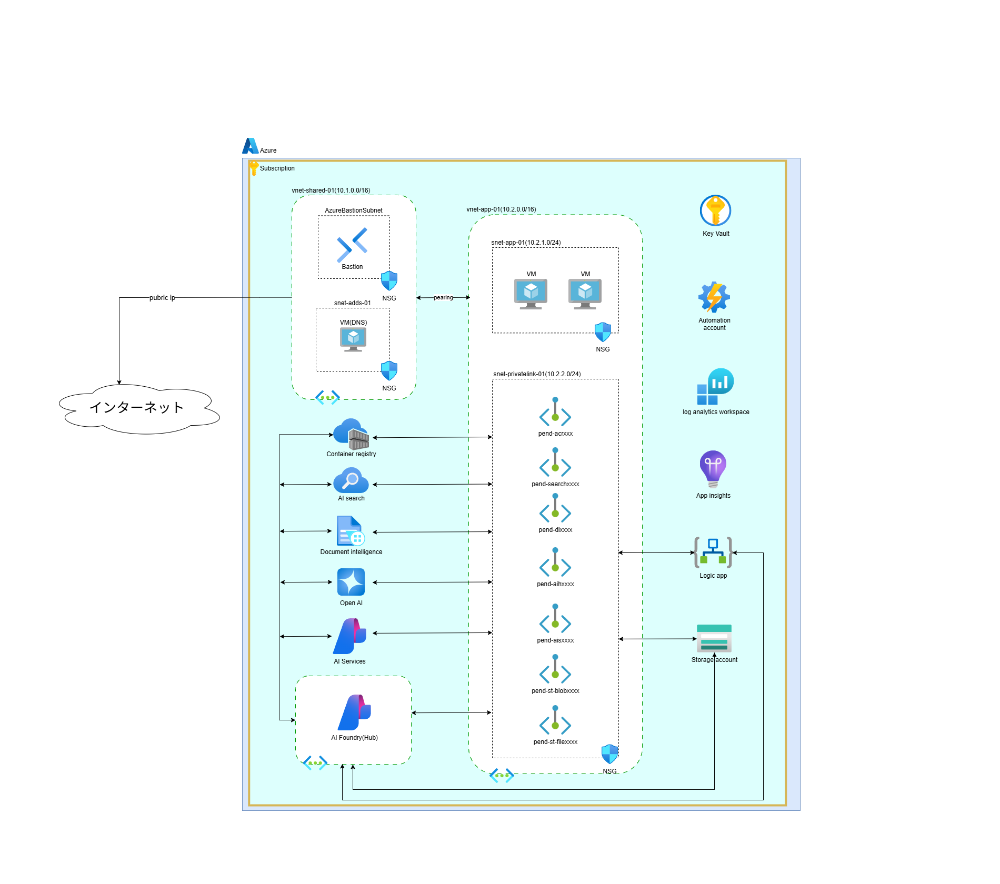

# 経歴/ポートフォリオページ 原稿

## ページ構成

### ヘッダー部分
- タイトル: 経歴/ポートフォリオ
- ナビゲーション: ホーム、プロフィール、スキル、資格、経歴/ポートフォリオ
- ダークモード切替ボタン

### メインコンテンツ

#### 導入文
私のこれまでの主要プロジェクトと実績をご紹介します。クラウド環境の設計・構築からインフラ運用、セキュリティ対策まで、幅広い経験を積んできました。各プロジェクトでは技術的な課題解決だけでなく、ドキュメント整備や知識共有にも注力し、チーム全体の生産性向上に貢献してきました。

#### プロジェクト一覧

## プロジェクト1: Kubernetes 監視基盤の設計・構築（AWS EKS）

### 概要
Kubernetes クラスタ内での監視構成を設計・構築しました。既存の Prometheus メトリクス取得に加え、自ら Config を設計して Loki へログを集約し、Grafana で一元的に可視化。さらに AWS 側のリソースとも連携し、メトリクスやログを統合しました。

### 主な成果と取り組み
- アラートルールを追加し、Teams への Webhook 通知を実装
- 特定のエラーログを検知すると通知する専用 Pod を開発し、障害対応の迅速化に寄与
- Helm、Flux、Kustomization の仕組みに苦戦しながらもキャッチアップを重ね、仕組みを理解して対応
- Kubernetes 初経験の中でも主体的に学習を進め、時間外や休日も学びながら対応した姿勢が評価
- 現場に有識者がほとんどいない状況下でも要望を満たす構成を実現
- 運用しやすくコストを意識したリソース設計を提供

### 使用技術
- AWS EKS (Elastic Kubernetes Service)
- Prometheus / Loki / Grafana
- Helm / Flux / Kustomization
- Microsoft Teams Webhook

## プロジェクト2: 不動産業者向け Web サーバレスアプリ インフラ設計・構築（AWS / Terraform）

### 概要
ユーザー認証付き Web サーバレスアプリケーションのインフラ設計・構築を担当しました。AWS 環境を Terraform による IaC でコード化し、CI/CD パイプラインを設計・構築。CloudFront、API Gateway、ECS、RDS、DynamoDB、Cognito などを組み合わせ、セキュアで冗長性のある環境を実現しました。

### 主な成果と取り組み
- 副業として限られた時間の中でキャッチアップを行い、短期間で高品質なインフラ基盤を構築
- AWS 全冠保持者（2024）としての知見を活かした最適なアーキテクチャ設計
- セキュリティと運用効率を両立するアーキテクチャを提供
- Terraform によるインフラのコード化で再現性と保守性を向上

### 使用技術
- AWS (CloudFront, API Gateway, ECS, RDS, DynamoDB, Cognito)
- Terraform
- CI/CD パイプライン
- サーバレスアーキテクチャ

## プロジェクト3: 社内向け RAG 基盤構築（PoC）

### 概要
Azure AI Foundry を活用した RAG 基盤導入の PoC を担当しました。サービス選定から環境構築、AI エージェントビルダーの調査、開発環境の整備や構築手順書の作成まで一貫して対応しました。

### 主な成果と取り組み
- 一般展開したばかりの新サービスで情報が少ない中、唯一の Azure 担当として迅速にキャッチアップ
- 責任を持って推進し、プロジェクトを成功に導いた
- RAG／AI エージェントに関する知識を習得
- セキュアな環境設計や運用ノウハウの確立に貢献
- 開発チームが効率的に作業できる環境を整備

### 使用技術
- Azure AI Foundry
- Azure OpenAI Service
- RAG (Retrieval-Augmented Generation)
- AI エージェントビルダー
- Azure リソース管理

## プロジェクト4: 大手保険会社向け Azure 基盤システム基盤設計・構築・運用保守

### 概要
大手保険会社向けに Azure 基盤システムの設計・構築・運用保守を担当しました。セキュリティ・可用性・運用性の確保に焦点を当て、包括的なクラウド基盤を実現しました。

### 主な成果と取り組み

#### セキュリティ面
- Azure AD による権限管理を基盤とし、条件付きアクセスと多要素認証（MFA）でゼロトラストを実現
- Azure Policy とログ管理で厳格な統制を実施
- Prisma Cloud による CSPM（Cloud Security Posture Management）を導入
- CrowdStrike Falcon センサーによるエンドポイント保護を実装
- DMZ 上の特定サーバに Squid を導入し、プロキシ制御とアクセスログ取得を実施

#### 可用性と事業継続性
- ExpressRoute の冗長接続により閉域網を確保
- Azure Backup と Recovery Services Vault を組み合わせ、RTO/RPO を最適化
- BCP/DR 対策を徹底

#### 運用性と監視
- Azure Monitor、Network Watcher、診断ログで監視を一元化
- Azure Automation による運用自動化で障害対応を迅速化
- JP1（Base／Job Management／監視／FTP連携）を展開し、統合運用を実現

### 使用技術
- Azure (ExpressRoute, Virtual Machines, NSG, Azure AD, Azure Policy)
- Prisma Cloud (CSPM)
- CrowdStrike Falcon
- JP1 (Hitachi)
- Squid プロキシ

## プロジェクト5: Microsoft Entra Connect サーバ構築（Azure IaaS）

### 概要
オンプレミス AD と Entra ID（旧 Azure AD）のユーザー同期基盤を設計・構築しました。JP1 Base・CrowdStrike を導入し、JP1 ジョブ管理（JP1/AJS）による週次ジョブで Primary/Secondary サーバの同期や、コスト削減のための自動電源制御ジョブを実装しました。

### 主な成果と取り組み
- 有識者不足による属人化解消のため、運用設計書の整備・勉強会の開催を主導
- Azure ユーザー管理作業の自動化を提案・実現し、知識の均一化と運用効率化に貢献
- Primary/Secondary サーバの同期ジョブを実装し、可用性を向上
- コスト削減のための自動電源制御ジョブを実装し、運用コストを最適化

### 使用技術
- Microsoft Entra Connect (旧 Azure AD Connect)
- Azure IaaS (Virtual Machines)
- Active Directory
- JP1/AJS (ジョブ管理)
- CrowdStrike Falcon

### フッター部分
- SNSリンク
- コピーライト情報
